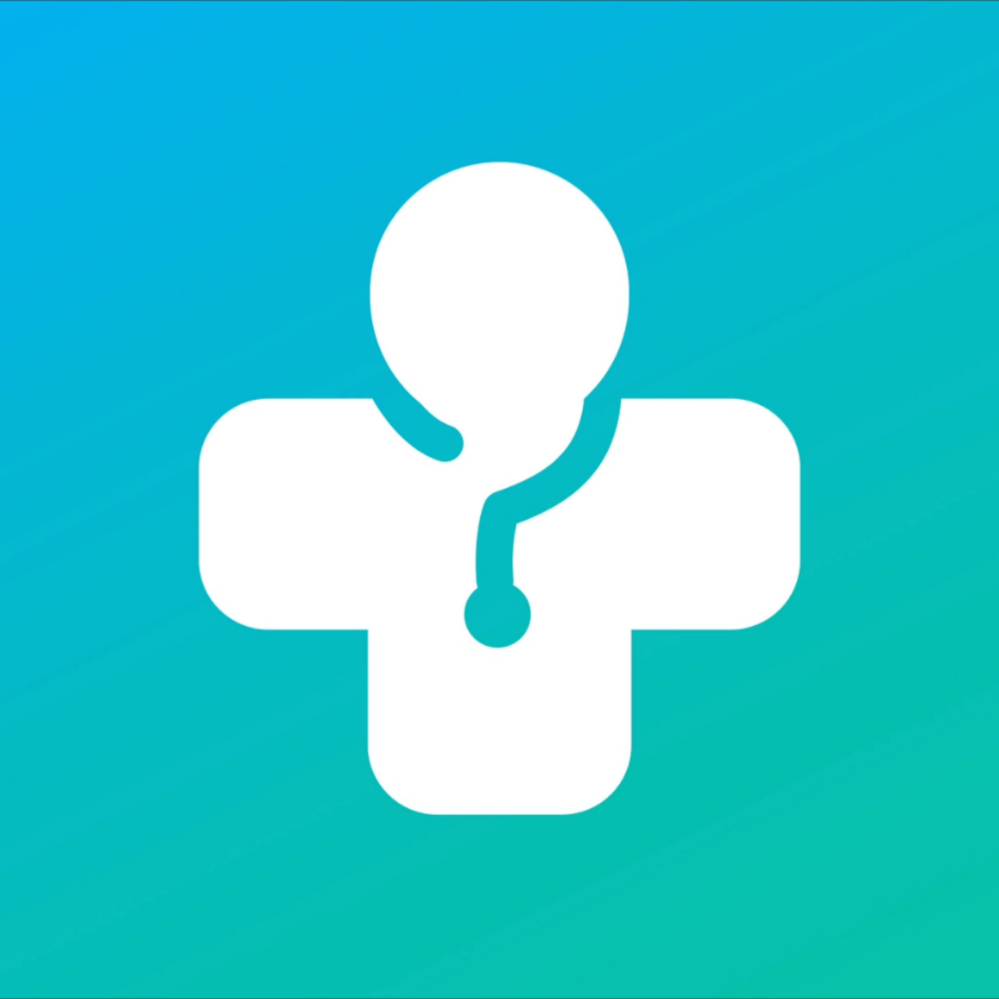

# Pezshkyar — Smart Medical Assistant



> **Pezshkyar** is an intelligent medical assistant application built with **Flutter**, offering a seamless, responsive, and beautiful experience across Android and iOS. This README provides a professional overview with design recommendations, animation usage, and full setup instructions.

---

## 🎯 Project Goals
- Provide fast, reliable medical information (general guidance — not a replacement for a doctor)
- Deliver a clean, minimal, and user-friendly interface (with RTL support for Persian)
- Smooth user experience with professional animations and micro-interactions
- Cross-platform support (Android & iOS) with local chat history storage

---

## 🔥 Preview
Add a **GIF demo or short video** to make the page visually appealing, for example:

`./assets/demo/demo.gif`  
(Create an `assets/demo/` folder and include demo files here)

---

## ⭐ Features
- 🩺 AI-powered medical consultation
- 💬 Chat interface with message history
- 🌙 Light & Dark mode toggle
- 🔔 Push notifications
- 📝 Quick replies for common medical questions
- 💾 Local storage of chat history
- 📎 Share & copy information
- 🌐 Multilingual (with RTL support)
- ✨ Subtle animations & smooth page transitions

---

## 🎨 Design & Animations (Recommendations)
To enhance user experience, consider combining the following:

- **Lottie animations** for splash, empty states, success/failure
- **Hero animations** for seamless transitions between screens
- **AnimatedList / AnimatedSwitcher** for message updates
- **Shimmer effect** for content placeholders
- **Implicit animations** (`AnimatedContainer`, `AnimatedOpacity`)
- **Custom transitions** using `PageRouteBuilder`

### Example: Add Lottie (pubspec.yaml)
```yaml
dependencies:
  lottie: ^2.2.0
```

### Example: Splash Screen with Lottie + FadeTransition
```dart
import 'package:flutter/material.dart';
import 'package:lottie/lottie.dart';

class SplashScreen extends StatefulWidget {
  @override
  _SplashScreenState createState() => _SplashScreenState();
}

class _SplashScreenState extends State<SplashScreen> with SingleTickerProviderStateMixin {
  late AnimationController _controller;

  @override
  void initState() {
    super.initState();
    _controller = AnimationController(vsync: this);
    Future.delayed(Duration(milliseconds: 1700), () {
      Navigator.of(context).pushReplacementNamed('/chat');
    });
  }

  @override
  void dispose() {
    _controller.dispose();
    super.dispose();
  }

  @override
  Widget build(BuildContext context) {
    return Scaffold(
      backgroundColor: Theme.of(context).scaffoldBackgroundColor,
      body: Center(
        child: Lottie.asset(
          'assets/animations/medical_splash.json',
          controller: _controller,
          onLoaded: (composition) {
            _controller
              ..duration = composition.duration
              ..forward();
          },
          width: 240,
          height: 240,
        ),
      ),
    );
  }
}
```

---

## 🏗️ Project Structure
```
lib/
├── config/
│   ├── app_routes.dart
│   ├── constants.dart
│   └── theme.dart
├── models/
│   └── message_model.dart
├── screens/
│   ├── chat_screen.dart
│   ├── settings_screen.dart
│   └── splash_screen.dart
├── services/
│   ├── api_service.dart
│   ├── notification_service.dart
│   └── storage_service.dart
├── widgets/
│   ├── chat_bubble.dart
│   ├── custom_drawer.dart
│   ├── glass_input_box.dart
│   └── typing_indicator.dart
├── main.dart
assets/
├── animations/
│   └── medical_splash.json
├── images/
│   └── logo.png
└── demo/
    └── demo.gif
```

---

## ⚙️ Dependencies (sample `pubspec.yaml`)
```yaml
environment:
  sdk: '>=2.18.0 <3.0.0'

dependencies:
  flutter:
    sdk: flutter
  cupertino_icons: ^1.0.2
  http: ^0.13.5
  provider: ^6.0.5
  shared_preferences: ^2.0.15
  lottie: ^2.2.0
  flutter_local_notifications: ^12.0.3
  intl: ^0.18.0
  flutter_svg: ^1.1.6

dev_dependencies:
  flutter_test:
    sdk: flutter
  flutter_launcher_icons: ^0.9.2
  flutter_native_splash: ^2.2.10
```

---

## 🚀 Run Locally
Ensure you have **Flutter SDK** installed.

1. Clone repository
```bash
git clone https://github.com/tsshack/pezshkyar-app.git
cd pezshkyar
```
2. Install dependencies
```bash
flutter pub get
```
3. Run the app
```bash
flutter run
```

### Build Release (Android)
```bash
flutter build apk --release
```

### Build Release (iOS)
```bash
flutter build ipa
```
(Requires Xcode & Apple Developer account)

---

## 🔐 API & Config
Store all **sensitive keys** in environment files or secure storage. Do not commit secrets to the repo.

```dart
class ApiConfig {
  static const String BASE_URL = 'https://api.pezshkyar.com';
  // Use secure storage or remote config for tokens
}
```

---

## 💡 Example Widget: Animated ChatBubble
```dart
import 'package:flutter/material.dart';

class ChatBubble extends StatelessWidget {
  final String text;
  final bool isMe;

  const ChatBubble({required this.text, this.isMe = false});

  @override
  Widget build(BuildContext context) {
    final radius = Radius.circular(16);
    return Align(
      alignment: isMe ? Alignment.centerRight : Alignment.centerLeft,
      child: TweenAnimationBuilder<double>(
        tween: Tween(begin: 0.8, end: 1.0),
        duration: Duration(milliseconds: 350),
        builder: (context, value, child) {
          return Transform.scale(
            scale: value,
            child: child,
          );
        },
        child: Container(
          margin: EdgeInsets.symmetric(vertical: 6, horizontal: 12),
          padding: EdgeInsets.symmetric(vertical: 12, horizontal: 16),
          decoration: BoxDecoration(
            color: isMe ? Theme.of(context).primaryColor : Colors.white,
            borderRadius: BorderRadius.only(
              topLeft: radius,
              topRight: radius,
              bottomLeft: isMe ? radius : Radius.circular(4),
              bottomRight: isMe ? Radius.circular(4) : radius,
            ),
            boxShadow: [
              BoxShadow(
                blurRadius: 6,
                color: Colors.black12,
                offset: Offset(0, 2),
              ),
            ],
          ),
          child: Text(
            text,
            style: TextStyle(
              color: isMe ? Colors.white : Colors.black87,
            ),
            textDirection: TextDirection.rtl,
          ),
        ),
      ),
    );
  }
}
```

---

## 🛠️ Recommended Packages
- `flutter_native_splash` — native splash screen
- `flutter_launcher_icons` — app icons
- `cached_network_image` — image caching
- `provider` or `riverpod` — state management
- `shimmer` — skeleton loading animations

---

## 🧪 Testing
- Unit and widget tests for chat logic & local storage
- Network behavior tests using mocks (e.g., Mockito)

---

## 🤝 Contributing
1. Fork the project
2. Create a feature branch: `git checkout -b feature/AmazingFeature`
3. Commit changes: `git commit -m "Add AmazingFeature"`
4. Push branch: `git push origin feature/AmazingFeature`
5. Open a Pull Request

Please open an issue first to discuss your proposal.

---

## 📝 License
This project is licensed under the **MIT License** — see the LICENSE file.

---

## 👨‍💻 Developer

**Ehsan Fazli**  
🚀 Full-Stack & Mobile Developer | Flutter Enthusiast | API Designer  

- 📧 Email: [ehsanehsanfazlinejad.com](mailto:ehsanehsanfazlinejad.com)  
- 🌐 Website: [https://ehsanjs.ir](https://ehsanjs.ir)  
- 💬 Telegram: [@Devehsan](https://t.me/Devehsan)  
- 🐙 GitHub: [tsshack](https://github.com/tsshack)  
- 🔗 LinkedIn: [linkedin.com/in/ehsanfazli](https://linkedin.com/in/ehsanfazli)  

---

## ⚠️ Disclaimer
Pezshkyar provides **general medical information** only. It is **not a substitute** for professional medical advice, diagnosis, or treatment. Always consult a qualified physician for medical concerns.

---

## ✅ Release Checklist
- [ ] Add screenshots & demo GIF
- [ ] Configure splash screen & icons
- [ ] Test on multiple devices & screen sizes
- [ ] Verify permissions & app store policies
- [ ] Remove all sensitive keys from repo
